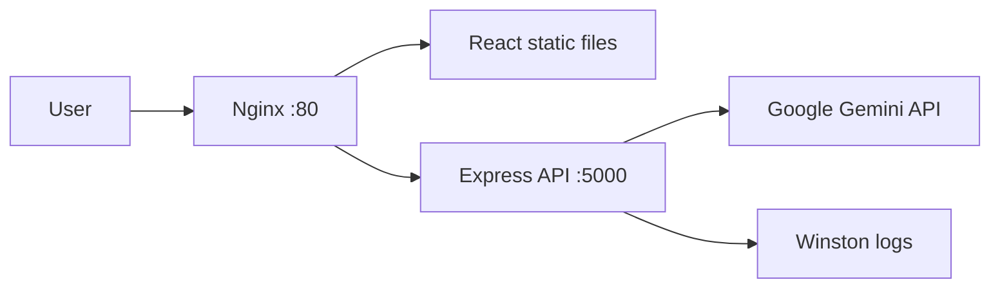

<table>
	<tr>
		<td><h1>GigBrief</h1></td>
		<td align="right"><a href="YOUR_VIDEO_URL">Video Tutorial</a> &nbsp;·&nbsp; <a href="YOUR_LIVE_DEMO_URL">Live Demo</a></td>
	</tr>
</table>

GigBrief turns a vague freelance client request into a practical project brief. It uses Gemini to suggest the likely scope, technology options, risks, and questions a freelancer should ask before accepting the work.

## Screenshots

## Features

- Converts unstructured client ideas into a consistent JSON brief
- Displays project summary, scope, technical suggestions, red flags, and discovery questions
- React frontend with a Vite development workflow
- Express backend with Gemini API integration
- Nginx reverse proxy serving the frontend and forwarding `/api` requests
- Rate limiting at both the Nginx and backend layers
- Structured Winston logging to the console and local log files
- Docker Compose setup for the full application

## Tech Stack

- **Frontend:** React, Vite, plain CSS
- **Backend:** Node.js, Express, Gemini API
- **Infrastructure:** Docker, Docker Compose, Nginx
- **Logging:** Winston

## Project Structure

```text
GigBrief/
├── backend/
│   ├── server.js        # Express API, Gemini integration, and rate limiting
│   ├── logger.js        # Winston console and file logging
│   ├── package.json     # Backend dependencies and scripts
│   ├── Dockerfile       # Backend container definition
│   └── logs/            # Local runtime logs (ignored by Git)
├── frontend/
│   ├── src/
│   │   ├── App.jsx      # Brief generator interface and API calls
│   │   ├── App.css      # Application styles
│   │   └── main.jsx     # React entry point
│   ├── index.html       # Frontend HTML entry point
│   ├── package.json     # Frontend dependencies and scripts
│   ├── vite.config.js   # Vite configuration and API proxy
│   └── Dockerfile       # Frontend build container definition
├── nginx/
│   ├── default.conf     # Static file server, reverse proxy, and rate limit
│   └── Dockerfile       # Nginx container definition
├── docker-compose.yml   # Multi-container development setup
├── .gitignore           # Ignored secrets, dependencies, builds, and logs
└── README.md            # Project documentation
```

## Architecture



The browser calls `POST /api/generate`. Nginx applies an edge rate limit, forwards the request to Express, and Express validates the input, applies its own per-IP limit, calls Gemini, and returns the parsed JSON response.

## Getting Started

### Prerequisites

- Docker Desktop with Docker Compose
- Node.js 18+ and npm for local development
- A Gemini API key from [Google AI Studio](https://aistudio.google.com/apikey)

### Configure the API key

Create `backend/.env`:

```env
GEMINI_API_KEY=your_actual_key_here
```

Never commit this file. The repository ignores environment files while allowing safe `.env.example` templates.

### Run with Docker Compose

Build the frontend once so Nginx can serve its output, then start the stack:

```bash
cd frontend
npm install
npm run build

cd ..
docker compose up --build -d
```

Open [http://localhost](http://localhost). The backend is also available at `http://localhost:5000`.

Stop the stack with:

```bash
docker compose down
```

### Run locally without Docker

Start the backend in one terminal:

```bash
cd backend
npm install
npm run dev
```

Start the frontend in another terminal:

```bash
cd frontend
npm install
npm run dev
```

Vite serves the frontend at `http://localhost:5173` and proxies `/api` requests to the backend.

## API

### `GET /api/health`

Returns the backend health status:

```json
{"status":"ok"}
```

### `POST /api/generate`

Request:

```json
{"clientInput":"I want an app like a food delivery platform but simpler"}
```

Successful responses contain:

```json
{
	"summary": "...",
	"scope": "...",
	"techSuggestions": ["..."],
	"redFlags": ["..."],
	"questionsToAsk": ["..."]
}
```

The API returns `400` for empty input, `429` after the request limit is exceeded, and `500` for configuration or upstream AI errors.

## Engineering Notes

- The Gemini key remains server-side and is never exposed to the browser.
- Nginx limits `/api/generate` to 5 requests per minute with a small burst allowance.
- Express maintains a second per-IP limit and returns a retry duration in rate-limit responses.
- Gemini output is requested as JSON and parsed before it is returned to the client.
- Development logs are written to `backend/logs/`, which is excluded from Git.

## Current Scope

This is a focused MVP. It has no database, authentication, persistent user history, or production-grade distributed rate limiting. The current goal is to validate the AI-assisted briefing workflow and the service architecture.

## Future Improvements

- Add user accounts and saved briefs
- Persist projects in a database
- Add automated API and frontend tests
- Use shared distributed rate limiting for multiple backend instances
- Add production deployment and monitoring
